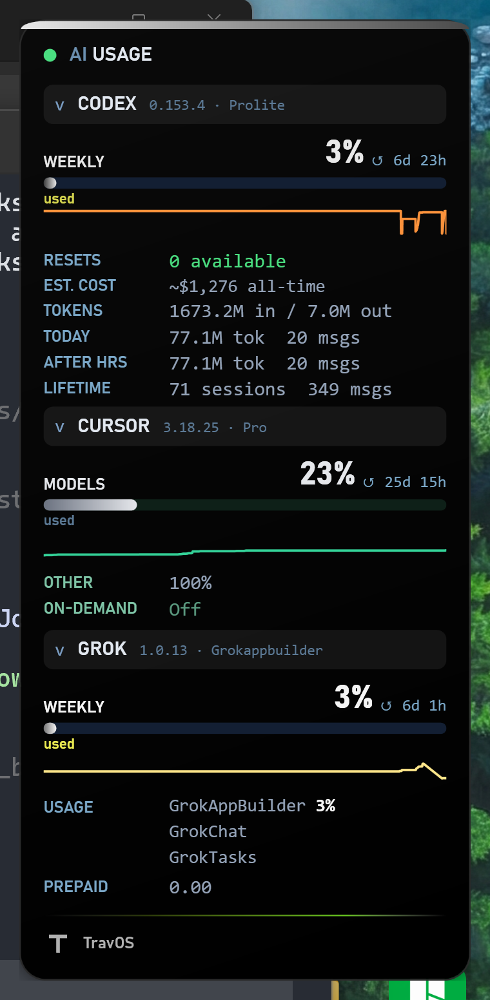

# AI Usage Overlay

Always-on-top Windows HUD for **Claude Code**, **Codex**, **Cursor**, and **Grok** - live quotas, local totals, and history sparks in one tray app.

**Version 0.4.2** (`v0.4.2`) — shown in the overlay footer, which turns amber when an update is waiting. Latest release: [v0.4.2](https://github.com/CosmonautJones/ai-usage-overlays/releases/tag/v0.4.2).



Built as a TravOS portfolio piece. Each provider is an independent adapter: one missing login does not take the others down.

## What it shows

| Provider | Live | Local / extra |
| --- | --- | --- |
| **Claude Code** | 5-hour, weekly, optional Fable/Opus windows | Identity, estimated cost, tokens, sessions |
| **Codex** | Weekly % + reset credits; **5-hour % when ChatGPT returns it** | Tokens, cost, today / after-hours, lifetime sessions |
| **Cursor** | **Cursor Models** % and plan used/limit from Plan & Usage, **Other Models** %, On-demand Off/$ | 30-day / today edits, top model, AI lines when analytics returns them (otherwise `--`) |
| **Grok** | SuperGrok / CLI weekly % and reset time; available one-time usage resets | Reset expiry on hover; plan / prepaid only if xAI sends them |

Optional **history sparks** sit under each real bar (Claude, Codex, Grok, Cursor Models). They record on every poll, including when Claude is signed out. The Cursor spark is plan utilization from usage-summary when that series exists (limit > 0 / a real %); it does not invent points from the legacy included-requests fields.

Hidden providers stay quiet: no tile, and Claude auth noise stays out of the top chrome when Claude is off (no **Auth expired** / **Not logged in** from Claude alone; the status dot is not red from Claude auth). Turn a provider back on anytime from the tray.

Grok Bot chat and Cursor-Grok are **not** a fifth tile - they stay under Cursor so nothing is double-counted.

Grok's **RESETS** row reports one-time usage resets separately from the scheduled weekly reset. Hover for the earliest expiry. `0 available` means the reset lookup succeeded with no currently valid resets; `--` means availability could not be verified. The overlay only reads availability. Redeem through Grok's own Usage page. This uses a web RPC whose schema and CLI-login support may change.

## Install

Windows 10/11, PowerShell 5.1 or 7+.

```powershell
irm https://raw.githubusercontent.com/CosmonautJones/ai-usage-overlays/master/install.ps1 | iex
```

That installs under `%LOCALAPPDATA%\AIUsageOverlay` and starts the unified overlay.

Or clone and run `Install.bat`. Login autostart uses `Start-Unified.vbs`.

Optional Windows installer: [AIUsageOverlaySetup.exe](https://github.com/CosmonautJones/ai-usage-overlays/releases/download/v0.4.2/AIUsageOverlaySetup.exe) from [Releases](https://github.com/CosmonautJones/ai-usage-overlays/releases) (`v0.4.2`). Once installed, the overlay updates itself: tray → **Updates** → **Check for updates** → **Install update**.

## Choose providers (first run)

On a fresh install (no saved state yet), the overlay opens a calm checklist: **Which providers do you use?**

- **Claude is off by default** for the stranger / demo path. Codex, Cursor, and Grok start on.
- Uncheck anything you do not use. Unused providers stay **hidden** — no empty tile, no auth nag from that adapter.
- Click **Continue**. Your choices persist with the rest of the HUD settings.

Change later without reinstalling:

1. Right-click the **AI** tray icon → **Providers**.
2. Pick **Choose providers…** for the same checklist, or toggle a single provider (Show/Hide) under that submenu.

Existing installs that already have a state file keep their current visibility; the picker does not reset them.

## First login (new users)

The overlay does **not** store passwords. It launches the real CLI so that tool writes its own `auth.json`.

1. Install a provider CLI if you want that tile (optional - skip any you do not use):
   - Claude: [Claude Code docs](https://docs.anthropic.com/en/docs/claude-code)
   - Codex: [Codex CLI](https://developers.openai.com/codex/cli) (`irm https://chatgpt.com/codex/install.ps1 | iex`)
   - Grok: [Grok Build docs](https://x.ai/docs/build/overview) (`irm https://x.ai/cli/install.ps1 | iex`) then restart the overlay
   - Cursor: [Cursor docs](https://cursor.com/docs) — sign in to the Cursor IDE
2. Right-click the **AI** tray icon → **Log in** → Claude / Codex / Grok.
3. Finish the browser / device prompt in the visible terminal. The HUD stays up and refreshes that provider when the CLI exits.

Missing CLIs show as disabled (`grok not installed`) instead of crashing. Grok also resolves `~\.grok\bin\grok.exe` when it is installed but not on PATH.

## Your own mark

Footer defaults to the TravOS slab-T. Right-click the tray → **Set footer brand…** to pick a PNG (saved as `%LOCALAPPDATA%\AIUsageOverlay\brand.png`), or **Reset TravOS mark** to remove it. You can still drop `brand.png` there by hand. Keep it small (tray-sized). Bad or missing file = TravOS.

## Usage

| Action | How |
| --- | --- |
| Show / hide overlay | Left-click the **AI** tray icon |
| Log in a provider | Right-click → Log in |
| Official platform pages | Right-click → **Platforms** → Claude / Codex / Cursor / Grok |
| Copy stats | Right-click → Copy stats to clipboard |
| Set / reset footer mark | Right-click → Brand → Set footer brand… / Reset TravOS mark |
| Choose / show / hide providers | Right-click → **Providers** → Choose providers… or toggle one |
| Expand / collapse | Click the section header |
| History sparks | Right-click → Show history graph |
| Refresh now | Right-click → Refresh now |
| JSON snapshot | `pwsh -NoLogo -NoProfile -File .\unified-overlay.ps1 -Json` |
| One provider | `pwsh -NoLogo -NoProfile -File .\unified-overlay.ps1 -Json -Provider Grok` |
| Theme / opacity / snap | Right-click → Theme / Opacity / Snap to corner |
| Compact / stats / alerts | Right-click → Compact mode / Show stats panel / Threshold alerts |
| View mode | Right-click → View → Pinned panel or Quake terminal |
| Start at login / start hidden | Right-click → Open at login / Start hidden to tray |
| Updates | Right-click → Updates → Check for updates |

Position, theme, opacity, compact, stats panel, history graph, threshold alerts, view mode, provider visibility, start-hidden, and footer brand persist across restart. Open at login is the Startup shortcut.

## Settings

Everything lives on the tray (right-click the overlay or the **AI** icon). Nothing requires a second window.

| Setting | Tray path | Persists |
| --- | --- | --- |
| Theme | Theme | Yes |
| Opacity | Opacity | Yes |
| Snap to corner | Snap to corner | Yes (saved Left/Top) |
| Compact mode | Compact mode | Yes |
| Stats panel | Show stats panel | Yes |
| History graph | Show history graph | Yes |
| Threshold alerts | Threshold alerts | Yes |
| View mode | View → Pinned / Quake | Yes |
| Footer brand | Brand | Yes (`brand.png`) |
| Provider visibility | Providers | Yes |
| Start at login | Open at login | Yes (Startup `.lnk`) |
| Start hidden | Start hidden to tray | Yes |

## Platform links

Same two-item shape for every vendor (usage/dashboard + install/docs). Labels differ because the vendors do.

| Provider | Usage / dashboard | Install / docs |
| --- | --- | --- |
| Claude | [claude.ai/settings/usage](https://claude.ai/settings/usage) | [Claude Code docs](https://docs.anthropic.com/en/docs/claude-code) |
| Codex | [chatgpt.com/codex](https://chatgpt.com/codex) | [Codex CLI](https://developers.openai.com/codex/cli) |
| Cursor | [cursor.com/settings](https://cursor.com/settings) | [Cursor docs](https://cursor.com/docs) |
| Grok | [console.x.ai](https://console.x.ai) | [Grok Build docs](https://x.ai/docs/build/overview) |

Hidden providers stay off the HUD but keep these links under **Platforms**.

## How it works

For the current reliability grade, verified fixes, live-check limitations, and service coverage, see [the September 9 hardening assessment](docs/hardening-assessment-2026-09-09.md). Quotas are provider observations; local totals cover available logs; estimated API value is not billed spend. The overlay is not a complete financial ledger.

PowerShell + WPF. Reads credentials you already have - it does not mint tokens.

- Claude quota: Anthropic OAuth usage, token under `~\.claude`
- Claude stats: JSONL under `~\.claude\projects`
- Codex live: `chatgpt.com/backend-api/wham/usage` via local Codex OAuth
- Codex stats: `~\.codex\sessions`
- Cursor: local auth DB + dashboard APIs (`usage-summary` for Plan & Usage; `sqlite3.exe` is bundled)
- Grok: `cli-chat-proxy.grok.com/v1/billing` via `~\.grok\auth.json` (OIDC `key`)

No admin rights. Snapshot schema stays `ai-usage.snapshot.v1` with a `providers` envelope (`claude`, `codex`, `cursor`, `grok`).

## Uninstall

**Settings → Apps → AI Usage Overlay**, or `Uninstall.bat` from `%LOCALAPPDATA%\AIUsageOverlay`.

## Development

See [docs/developer-procedures.md](docs/developer-procedures.md).

```powershell
pwsh -NoLogo -NoProfile -Command "Invoke-Pester -Path tests"
```

Default branch is `master`. Short-lived feature branches, PRs, personal account only ([CosmonautJones/ai-usage-overlays](https://github.com/CosmonautJones/ai-usage-overlays)).
