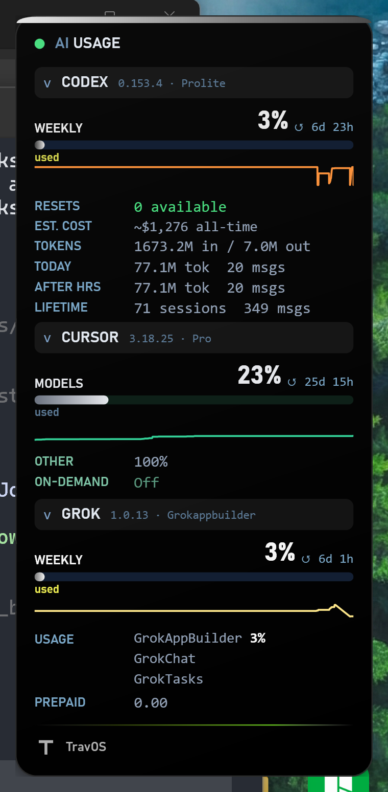

<div align="center">

# AI Usage Overlay

**The always-on-top HUD for the AI plans you are about to hit.**

Claude Code. Codex. Cursor. Grok. One tray icon.

Live quotas, local totals, and history sparks. Each provider is its own adapter, so one missing login leaves the rest of the HUD up.

[](https://github.com/CosmonautJones/ai-usage-overlays/releases/tag/v0.4.3)
[](https://github.com/CosmonautJones/ai-usage-overlays/releases)
[](https://github.com/CosmonautJones/ai-usage-overlays)
[](LICENSE)

<br>

[Install](#install) · [What you see](#what-you-see) · [First run](#first-run) · [Tray](#tray) · [Where the numbers come from](#where-the-numbers-come-from)



<sub>Version <strong>0.4.3</strong> in the footer. The footer turns amber when an update is waiting. Latest release: <a href="https://github.com/CosmonautJones/ai-usage-overlays/releases/tag/v0.4.3">v0.4.3</a>.</sub>

</div>

## Install

Windows 10/11. One line:

```powershell
irm https://raw.githubusercontent.com/CosmonautJones/ai-usage-overlays/master/install.ps1 | iex
```

That installs under `%LOCALAPPDATA%\AIUsageOverlay` and starts the HUD. Login autostart uses `Start-Unified.vbs`.

Or clone and run `Install.bat`.

Or download [AIUsageOverlaySetup.exe](https://github.com/CosmonautJones/ai-usage-overlays/releases/download/v0.4.3/AIUsageOverlaySetup.exe) from [Releases](https://github.com/CosmonautJones/ai-usage-overlays/releases). After that, updates live on the tray: **Updates → Check for updates → Install update**.

## What you see

Four tiles. Hide any you do not use. A hidden provider has no tile and no auth nag.

| Provider | Live | On this machine |
| --- | --- | --- |
| **Claude Code** | 5-hour, weekly, and Fable/Opus windows when Anthropic sends them | Account, estimated cost, tokens, sessions |
| **Codex** | Weekly %, reset credits, **ChatGPT usage credits remaining**, and the 5-hour % when ChatGPT returns it | Tokens, cost, today, after-hours, lifetime sessions |
| **Cursor** | Models % from Plan & Usage, Other Models %, on-demand Off or dollars | 30-day and today edits, top model, AI lines when analytics returns them |
| **Grok** | Weekly % and reset time, plus one-time usage resets | Plan and prepaid only when xAI sends them |

History sparks sit under each real bar. They record on every poll, including while Claude is signed out. The Cursor spark is plan utilization from usage-summary when that series exists. It stays quiet when the legacy included-requests fields are all the API sent.

Codex **CREDITS** is the balance from ChatGPT **Settings → Usage**. The same number you buy, reload, and spend after the plan limit. **RESETS** is the separate bank of rate-limit resets. `61,903 remaining` and `1 available` are two different piles.

Grok **RESETS** is one-time usage resets, separate from the weekly reset. Hover for the earliest expiry. `0 available` means the lookup succeeded and none are valid. `--` means availability could not be verified. Redeem on Grok's own Usage page. This reads a web RPC whose schema and CLI login can change.

Grok Bot chat and Cursor-Grok stay under Cursor. They are not a fifth tile.

## First run

A fresh install asks **Which providers do you use?**

- Claude starts off. Codex, Cursor, and Grok start on.
- Uncheck anything you skip. That tile stays hidden.
- **Continue.** The choice is saved with the rest of the HUD.

Change it later from the tray: **Providers → Choose providers…**, or toggle one provider. An install that already has a state file keeps its current visibility.

### Sign in

The overlay launches the real CLI. That CLI writes its own `auth.json`. Passwords stay in the vendor login.

1. Install the CLIs you want a tile for:
   - Claude: [Claude Code](https://docs.anthropic.com/en/docs/claude-code)
   - Codex: [Codex CLI](https://developers.openai.com/codex/cli) (`irm https://chatgpt.com/codex/install.ps1 | iex`)
   - Grok: [Grok Build](https://x.ai/docs/build/overview) (`irm https://x.ai/cli/install.ps1 | iex`), then restart the overlay
   - Cursor: [Cursor](https://cursor.com/docs), signed in inside the IDE
2. Right-click the **AI** tray icon → **Log in** → Claude, Codex, or Grok.
3. Finish the browser or device prompt. The HUD stays up and refreshes that provider when the CLI exits.

A missing CLI shows as disabled (`grok not installed`). Grok also resolves `~\.grok\bin\grok.exe` when it is installed and off PATH.

### Your mark

The footer starts as the TravOS slab-T. Tray → **Set footer brand…** saves a PNG as `%LOCALAPPDATA%\AIUsageOverlay\brand.png`. **Reset TravOS mark** removes it. You can also drop `brand.png` there yourself. Keep it small. A bad or missing file falls back to TravOS.

## Tray

Right-click the overlay or the **AI** icon. Every setting is there.

| Do this | How |
| --- | --- |
| Show or hide | Left-click the **AI** icon |
| Log in | **Log in** |
| Open the vendor page | **Platforms** |
| Copy a text snapshot | **Copy stats to clipboard** |
| Pick providers | **Providers** |
| Sparklines | **Show history graph** |
| Refresh | **Refresh now** |
| Theme, opacity, corner | **Theme** / **Opacity** / **Snap to corner** |
| Compact, stats, alerts | **Compact mode** / **Show stats panel** / **Threshold alerts** |
| Pinned panel or terminal | **View** |
| Start with Windows, or hidden | **Open at login** / **Start hidden to tray** |
| Update | **Updates** |

Click a section header to expand or collapse it.

Position, theme, opacity, compact mode, stats panel, history, alerts, view mode, provider visibility, start-hidden, and the footer mark persist. Open at login is a Startup shortcut.

JSON from a terminal:

```powershell
pwsh -NoLogo -NoProfile -File .\unified-overlay.ps1 -Json
pwsh -NoLogo -NoProfile -File .\unified-overlay.ps1 -Json -Provider Grok
```

### Settings that stick

| Setting | Tray path | Persists |
| --- | --- | --- |
| Theme | Theme | Yes |
| Opacity | Opacity | Yes |
| Snap to corner | Snap to corner | Yes, saved Left/Top |
| Compact mode | Compact mode | Yes |
| Stats panel | Show stats panel | Yes |
| History graph | Show history graph | Yes |
| Threshold alerts | Threshold alerts | Yes |
| View mode | View → Pinned / Quake | Yes |
| Footer brand | Brand | Yes, `brand.png` |
| Provider visibility | Providers | Yes |
| Start at login | Open at login | Yes, Startup `.lnk` |
| Start hidden | Start hidden to tray | Yes |

### Platform links

Each vendor gets the same pair: the usage page, and the install docs.

| Provider | Usage | Install |
| --- | --- | --- |
| Claude | [claude.ai/settings/usage](https://claude.ai/settings/usage) | [Claude Code docs](https://docs.anthropic.com/en/docs/claude-code) |
| Codex | [chatgpt.com/codex](https://chatgpt.com/codex) | [Codex CLI](https://developers.openai.com/codex/cli) |
| Cursor | [cursor.com/settings](https://cursor.com/settings) | [Cursor docs](https://cursor.com/docs) |
| Grok | [console.x.ai](https://console.x.ai) | [Grok Build docs](https://x.ai/docs/build/overview) |

Hidden providers stay off the HUD and keep their links under **Platforms**.

## Where the numbers come from

PowerShell and WPF. The overlay reads credentials you already have.

| Source | What it reads |
| --- | --- |
| Claude quota | Anthropic OAuth usage, token under `~\.claude` |
| Claude stats | JSONL under `~\.claude\projects` |
| Codex live | `chatgpt.com/backend-api/wham/usage` with the local Codex OAuth token. Weekly, 5-hour, reset credits, and the usage-credit balance |
| Codex stats | `~\.codex\sessions` |
| Cursor | Local auth DB and dashboard APIs. `usage-summary` is Plan & Usage. `sqlite3.exe` ships with the app |
| Grok | `cli-chat-proxy.grok.com/v1/billing` via `~\.grok\auth.json` |

No admin rights. The snapshot schema is `ai-usage.snapshot.v1` with a `providers` envelope: `claude`, `codex`, `cursor`, `grok`.

Quotas are what the provider reported on the last successful poll. Local totals cover the logs on disk. Estimated cost is tokens times a price table. It is a local estimate, and it is separate from the invoice and from the ChatGPT credit balance.

For the reliability write-up, see [the September 9 hardening assessment](docs/hardening-assessment-2026-09-09.md).

## Uninstall

**Settings → Apps → AI Usage Overlay**, or run `Uninstall.bat` from `%LOCALAPPDATA%\AIUsageOverlay`.

## Develop

[docs/developer-procedures.md](docs/developer-procedures.md)

```powershell
pwsh -NoLogo -NoProfile -Command "Invoke-Pester -Path tests"
```

Default branch is `master`. Short-lived feature branches and pull requests. Public repo: [CosmonautJones/ai-usage-overlays](https://github.com/CosmonautJones/ai-usage-overlays).

## License

[MIT](LICENSE)
